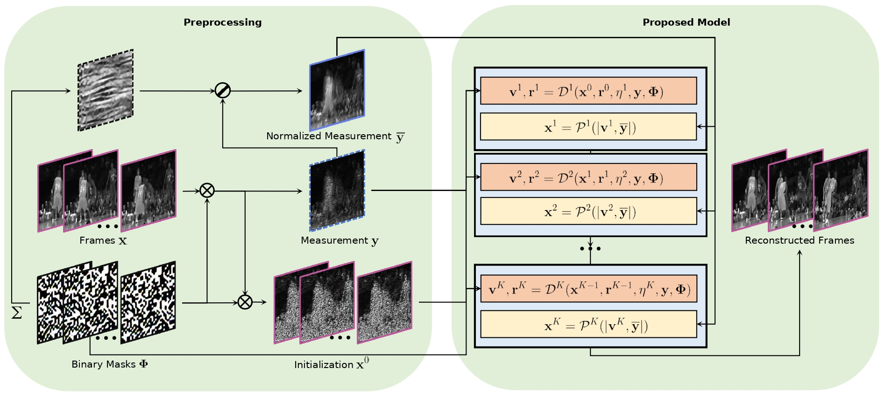

# Dense Deep Unfolding Network with 3D-CNN Prior for Snapshot Compressive Imaging [PyTorch]

This repository is the code for the following paper:

Zhuoyuan Wu,  [Jian Zhang](http://jianzhang.tech/), Chong Mou. Dense Deep Unfolding Network with 3D-CNN Prior for Snapshot Compressive Imaging. ICCV 2021. [[PDF][https://arxiv.org/abs/2109.06548]]

## Introduction

Snapshot compressive imaging (SCI) aims to record three-dimensional signals via a two-dimensional camera. For the sake of building a fast and accurate SCI recovery algorithm, we incorporate the interpretability of model-based methods and the speed of learning-based ones and present a novel dense deep unfolding network (DUN) with 3D-CNN prior for SCI, where each phase is unrolled from an iteration of Half-Quadratic Splitting (HQS). To better exploit the spatial-temporal correlation among frames and address the problem of information loss between adjacent phases in existing DUNs, we propose to adopt the 3D-CNN prior in our proximal mapping module and develop a novel dense feature map (DFM) strategy, respectively. Besides, in order to promote network robustness, we further propose a dense feature map adaption (DFMA) module to allow inter-phase information to fuse adaptively. All the parameters are learned in an end-to-end fashion. Extensive experiments on simulation data and real data verify the superiority of our method. 



Figure 1: Illustration of the video SCI (left) and our proposed framework (right) . 

## Prerequisite

```shell
$ conda install pytorch=1.4
$ conda install torchvision
$ conda install scikit-image
$ conda install -c menpo opencv
$ conda install -c conda-forge tensorboardx 
$ pip install --extra-index-url https://developer.download.nvidia.com/compute/redist/cuda/10.0 nvidia-dali==0.22.0
$ git clone https://www.github.com/nvidia/apex
$ cd apex
$ python setup.py install
```

## Test

Download our trained model from the [Google Drive](https://drive.google.com/file/d/1C9eWMf4hSBpPP8qLqCA_3rbQTR4XL3rm/view?usp=sharing) and place it under the checkpoint folder.

Test on the simulation data:

```shell
python test.py --test_dir ./simulation_dataset --result ./checkpoint/net_200.pth --layer_num 10 --temporal_patch 3 --n_channels 1
```

## Train

Download the DAVIS dataset from the [Google Drive](https://drive.google.com/drive/folders/1_Fg5SSsLTuUypsYg7gjQ2iGRpn3p0czs?usp=sharing)

```shell
export OMP_NUM_THREADS="4"

python -m torch.distributed.launch --nproc_per_node=4 train.py --batch_size 4 --learning_rate 4e-6 --max_number_patches 25600  --patch_size 128 --n_channels 1 --layer_num 10  --warmup_steps 5 --opt-level O1 --end_epoch 200 --algo_name 3DCN_RFMA_layer10 --sRGB_path ./DAVIS-train-mp4 --test_path ./simulation_data
```

OMP_NUM_THREADS means the number of process started for each GPU.
--nproc_per_node is the number of GPUs

## Results


## Citation
If you find the code helpful in your resarch or work, please cite the following paper.
```
@inproceedings{wu2021SCI3D,
  title={Dense Deep Unfolding Network with 3D-CNN Prior for Snapshot Compressive Imaging},
  author={Wu, Zhuoyuan and Zhang, Jian and Mou, Chong},
  booktitle={IEEE International Conference on Computer Vision (ICCV)},
  year={2021}
}
```